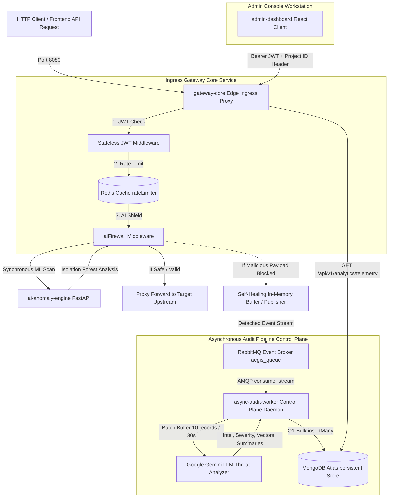

# 🛡️ AegisGate - Multi-Tenant Edge Security Shield & AI Anomaly Detection Pipeline

AegisGate is a high-performance, multi-tenant cybersecurity edge ingress proxy, stateless JWT authentication gateway, Redis-driven rate limiter, and machine-learning AI firewall. Backed by a decoupled asynchronous event-driven threat analysis pipeline (RabbitMQ, Google Gemini LLM) and an O(1) bulk MongoDB audit worker, it streams live telemetry into a cybersecurity-themed React console workspace.

---

## 📐 Unified Cybersecurity System Architecture



---

## 📦 Microservices Directory Breakdown

AegisGate is structured as an isolated, modern multi-workspace repository dividing proxy mechanisms (Data Plane), backend engines, and auditing daemons (Control Plane):

```text
aegis-gate/
├── services/
│   ├── gateway-core/           # Node.js/TypeScript Ingress Gateway & Edge Ingress Proxy (Port 8080)
│   ├── async-audit-worker/     # Node.js/TypeScript Event Consumer & Bulk Mongoose Persister
│   ├── ai-anomaly-engine/      # FastAPI/Python Machine Learning Anomaly Inspector (Port 8000)
│   └── admin-dashboard/        # Vite React/TypeScript Cybersecurity Control Terminal Workspace
├── scripts/
│   └── vps-setup.sh            # Automated Cloud VPS Provisioning and Firewall Script
├── docker-compose.yml          # Local Dev Environment Orchestration
├── docker-compose.prod.yml     # Production Orchestration Mesh configuration
└── README.md                   # System Operations Manual
```

### 1. `gateway-core` Ingress Ingress Gateway
* **Stateless Auth Routing (`src/routes/auth.ts`)**: Registers and authenticates developers (`POST /api/v1/auth/register`, `POST /api/v1/auth/login`) securely hashing passwords with `bcryptjs` (salt rounds 10) and issuing stateless `jsonwebtoken` (JWT) authorization structures.
* **Environment Provisioner (`src/routes/projects.ts`)**: Generates cryptographically secure API keys prefixed with `ag_live_` (`POST /api/v1/projects`), automatically linking project configurations to authenticated developer accounts.
* **Telemetry & Ingestion (`src/routes/analytics.ts`)**: Secures analytics endpoints strictly verifying project developer ownership before querying MongoDB logs, and validating ObjectIds cleanly to prevent server crashes.
* **AI Firewall Middleware (`src/middleware/aiFirewall.ts`)**: Synchronously extracts structural metrics of query queries (body length, injection-sensitive special characters, curly nesting, JSON key colons) and feeds them into the FastAPI anomaly engine before forwarding proxy stream headers downstream.
* **Self-Healing Message Broker (`src/config/queue.ts`)**: Implements an async RabbitMQ connection loop with a recursive 5-second retry backoff. If RabbitMQ is offline during anomaly detection, blocks thread blocks by automatically caching payloads into a transient in-memory array, draining them automatically onto the event stream once broker connections restore.

### 2. `ai-anomaly-engine` Anomaly Machine Learning Inspector
* **Engine Type**: Built as a lightweight pythonic FastAPI microservice.
* **Algorithm**: Employs an **Isolation Forest (ISOF)** model fitted against synthetic and real structural request bodies.
* **Host Binding**: Set strictly to bind to the remote container layer interface `0.0.0.0` over Port `8000`.

### 3. `async-audit-worker` Control Plane Auditing Daemon
* **Channel Prefetch Configuration**: Implements high-throughput limits (`channel.prefetch(20)`) to protect broker resources during high-volume DDoS incidents.
* **Round-Trip Bulk Mongoose Optimization**: Batches intercepted events in-memory, flushing immediately when the buffer reaches exactly `10` records or at a `30-second` rolling fallback interval.
* **Google Gemini AI Threat Categorization**: Issues real-time JSON-schema POST requests to Google Gemini LLM models automatically diagnosing:
  * Origin Client IP & HTTP Request endpoints.
  * Hashed password payload signatures.
  * Maps records cleanly to **Attack Vector Categories**, **Severity Levels** (CRITICAL, HIGH, MEDIUM, LOW), and writes **Cybersecurity Intel Summaries** in plain text.
* **Durability Fail-Open Safeguards**: If database lookups or LLM APIs time out, releases pending payloads back to RabbitMQ using manual nack handles (`channel.nack(msg, false, true)`) to prevent packet loss.

### 4. `admin-dashboard` React Cybersecurity Workspace
* **Context State Management (`src/context/AuthContext.tsx`)**: Integrates react contexts storing user tokens and selected project parameters, syncing states instantly with `localStorage`.
* **Security Route Guards (`src/components/ProtectedRoute.tsx`)**: Validates token credentials, redirecting unauthorized sessions back to `/auth` cleanly.
* **Dynamic Droplist selectors (`src/components/Dashboard.tsx`)**: Queries developer-owned project registers. Populates an interactive `<select>` dropdown selector next to status gauges in the header, letting developers dynamically isolate and query segmented multi-tenant telemetry datasets.

---

## ⚙️ Configuration & Environment Parameters

Create a `.env` file in the root context of the project before booting the containers.

```ini
# --- Persistence and Broker Credentials ---
MONGO_URI=mongodb+srv://<USER>:<PASSWORD>@aegis-cluster.mongodb.net/AegisGate?retryWrites=true&w=majority
RABBITMQ_URL=amqp://aegis-queue:5672
REDIS_URL=redis://aegis_cache:6379

# --- Secret Auth Key bounds ---
JWT_SECRET=your_jwt_signing_key_here
LLM_API_KEY=your_google_gemini_api_key_here

# --- Network Port Mappings ---
PORT=8080
AI_ANOMALY_ENGINE_URL=http://ai-anomaly-engine:8000/analyze
VITE_API_BASE_URL=http://localhost:8080
```

---

## 🐳 Docker Orchestration & Production Mesh

AegisGate leverages Docker's built-in DNS and streamlined bridge routing networks to segregate inter-service traffic. Under `docker-compose.prod.yml`, all services communicate internally over a private network mesh `aegis_mesh`:

* `gateway-core` connects securely to `aegis_cache` (Redis) on port `6379`.
* `gateway-core` synchronously checks structural metrics via `ai-anomaly-engine` on port `8000`.
* `gateway-core` and `async-audit-worker` communicate with `aegis_queue` (RabbitMQ) on port `5672`.

### Production Dockerfiles Configuration:
- **`services/gateway-core/Dockerfile`**: Optimized multi-stage Node distribution compilation. Stage 1 compiles TS into ESNext JS binaries, and Stage 2 runs minimal production environments (`npm ci --only=production`), copying compiled `./dist` paths.
- **`services/async-audit-worker/Dockerfile`**: High-performance multi-stage daemon distribution skipping developer packages.
- **`services/ai-anomaly-engine/Dockerfile`**: Secure Python-slim image exposing FastAPIs.

---

## 🚀 Automated Cloud VPS Deployment (Ubuntu Staging Blueprint)

We supply a production server provisioning automation script at `scripts/vps-setup.sh`.

### Firewall Ports Mapping Matrix

To ensure absolute network security in production clouds (AWS, GCP, DigitalOcean), enforce the following firewall parameters:

| Port / Protocol | Target Service Component | Mesh Access Boundary | Public Internet Access Status |
| :--- | :--- | :--- | :--- |
| **8080 (TCP)** | Public Edge Ingress Proxy (`gateway-core`) | Ingress Gateway Ingress | **OPEN** (For dashboard and clients) |
| **8000 (TCP)** | AI Anomaly ML Engine (`ai-anomaly-engine`) | Private `aegis_mesh` | **CLOSED** (Internal only) |
| **5672 (TCP)** | RabbitMQ Message Broker (`aegis_queue`) | Private `aegis_mesh` | **CLOSED** (Internal only) |
| **6379 (TCP)** | Redis Rate Limit Cache (`aegis_cache`) | Private `aegis_mesh` | **CLOSED** (Internal only) |
| **22 (TCP)** | System SSH Port | Host Interface | **OPEN** (Restricted to Developer IP) |

### 🛠️ Deploying to VPS in 3 Steps:

1. **Provision Infrastructure**: Run our setup script to install Docker, Docker Compose, standalone binaries, and apply strict UFW firewall protocols automatically:
   ```bash
   chmod +x scripts/vps-setup.sh
   sudo ./scripts/vps-setup.sh
   ```
2. **Clone & Configure Env**:
   ```bash
   git clone https://github.com/RohitSirvi898/AegisGate.git aegis-gate
   cd aegis-gate
   nano .env # Populate MONGO_URI, JWT_SECRET, LLM_API_KEY, and base URLs
   ```
3. **Boot Production Mesh**: Detach microservice containers in daemon mode:
   ```bash
   docker-compose -f docker-compose.prod.yml up -d --build
   ```

---

## 🧪 Safe-Fail Verification Metrics

Confirm operational sanity by validating compilation parameters across workspaces:

```bash
# gateway-core TypeScript Check
cd services/gateway-core && npm run build

# async-audit-worker TypeScript Check
cd services/async-audit-worker && npx tsc --noEmit

# admin-dashboard React Build Check
cd services/admin-dashboard && npm run build
```
