# 🛡️ AegisGate - Multi-Tenant Edge Security Shield & AI Anomaly Detection Pipeline

AegisGate is a high-performance, sub-100ms multi-tenant cybersecurity edge ingress proxy, stateless JWT authentication gateway, atomic O(1) Redis-driven rate limiter, and machine-learning AI firewall. Featuring 300s TTL Redis hot-path lookup caching, non-blocking asynchronous RabbitMQ telemetry logging, and HTTP socket connection pooling (`keepAlive: true`, `maxSockets: 100`), it streams live security intelligence into a cybersecurity-themed React console workspace.

---

## 📐 Unified Cybersecurity System Architecture

```mermaid
%%{init: {'flowchart': {'htmlLabels': true, 'curve': 'bump'}, 'theme': 'base', 'themeVariables': { 'primaryColor': '#1e293b', 'primaryTextColor': '#f8fafc', 'primaryBorderColor': '#334155', 'lineColor': '#94a3b8'}}}%%
graph LR
    %% External Entities
    Client("🌐 Frontend API /<br/>HTTP Client")
    DashApp("💻 admin-dashboard<br/>React App")

    %% Core Gateway Subgraph
    subgraph GWCore ["🔐 Edge Ingress (gateway-core)"]
        direction TB
        Ingress["Edge Proxy<br/>(Port 8080)"]
        JWT{"Stateless<br/>JWT Auth"}
        Redis[("Redis<br/>Rate Limit")]
        AIFire{"AI Firewall<br/>Middleware"}
        Proxy["Proxy Forwarder<br/>(Upstream)"]
    end

    %% AI Engine
    FastAPI["🧠 ai-anomaly-engine<br/>(FastAPI / ISOF)"]

    %% Async Audit Subgraph
    subgraph AuditPlane ["⚙️ Async Audit Pipeline"]
        direction TB
        Queue["In-Memory<br/>Buffer"]
        RabbitMQ[["RabbitMQ<br/>Broker"]]
        Worker["async-audit-worker<br/>(Daemon)"]
        GeminiAI{"Google<br/>Gemini LLM"}
    end

    %% Data Store
    Mongo[("MongoDB Atlas<br/>(Persistent Store)")]

    %% Flow connections
    Client -->|Port 8080| Ingress
    DashApp -->|JWT + Project ID| Ingress

    Ingress --> JWT
    JWT --> Redis
    Redis --> AIFire

    %% AI Sync loop
    AIFire <-->|Synchronous<br/>ML Scan| FastAPI

    %% Good traffic
    AIFire -->|Safe ✓| Proxy

    %% Bad traffic
    AIFire -.->|Malicious ✗| Queue
    Queue -.-> RabbitMQ
    RabbitMQ -.->|AMQP Stream| Worker
    Worker <-->|Batch 10/30s| GeminiAI
    Worker -->|Bulk Insert| Mongo

    %% Dashboard telemetry fetch
    Ingress -.->|GET /telemetry| Mongo

    %% Styling
    classDef default fill:#1e293b,stroke:#475569,stroke-width:2px,color:#f8fafc;
    classDef db fill:#064e3b,stroke:#059669,stroke-width:2px;
    classDef ai fill:#4c1d95,stroke:#7c3aed,stroke-width:2px;
    classDef broker fill:#7c2d12,stroke:#ea580c,stroke-width:2px;

    class Redis,Mongo db;
    class FastAPI,GeminiAI ai;
    class RabbitMQ broker;
```



---

## ⚡ 5-Minute Developer Quickstart (Drop-In Proxy)

AegisGate acts as a transparent reverse proxy for your existing backend APIs. You simply drop the security shield in front of your microservice container, seal off direct internet access to your backend API, and point your frontend to the proxy port. No code changes are required in your backend services.

### Step 1: The Docker Compose Configuration

Create a `docker-compose.yml` file to run your backend inside a secure mesh network behind the AegisGate proxy. This allows AegisGate to intercept and analyze all traffic, while completely hiding your backend API from public ingress ports.

```yaml
version: '3.8'

services:
  # Your existing API backend, completely isolated from public ingress
  my-backend-api:
    image: your-developer-username/my-backend-api:latest
    container_name: my_backend_api
    expose:
      - "5000"
    networks:
      - secure_mesh

  # AegisGate Edge Proxy shielding your backend
  aegis-gateway:
    image: rohitsirvi/aegisgate-core:latest
    container_name: aegis_gateway
    ports:
      - "8080:8080" # Exposed publicly to accept secure frontend queries
    environment:
      - PORT=8080
      - UPSTREAM_TARGET_URL=http://my-backend-api:5000
      - AI_ANOMALY_ENGINE_URL=http://aegis-ai:8000/analyze
      - REDIS_URL=redis://aegis-cache:6379
      - RABBITMQ_URL=amqp://aegis-queue:5672
    depends_on:
      - aegis-cache
      - aegis-queue
      - aegis-ai
    networks:
      - secure_mesh

  # Dynamic Isolation Forest ML Engine
  aegis-ai:
    image: rohitsirvi/aegisgate-ai:latest
    container_name: aegis_ai
    networks:
      - secure_mesh

  # Redis Distributed Cache for Rate Limiting
  aegis-cache:
    image: redis:7-alpine
    container_name: aegis_cache
    networks:
      - secure_mesh

  # RabbitMQ Broker for Asynchronous Threat Logging
  aegis-queue:
    image: rabbitmq:3-management-alpine
    container_name: aegis_queue
    networks:
      - secure_mesh

networks:
  secure_mesh:
    driver: bridge
```

### Step 2: Boot the Shield

Spin up the entire shielded infrastructure with a single orchestration command:

```bash
docker compose up -d
```

### Step 3: Route Your Traffic

Generate a cryptographically secure tenant API access key from the AegisGate Cloud Console. Point your frontend fetch requests to the proxy host (`http://localhost:8080`), injecting the custom `x-aegis-api-key` header to secure your traffic automatically:

```javascript
// Example: Shielded request routed through AegisGate Ingress Proxy
fetch('http://localhost:8080/api/v1/users', {
  method: 'POST',
  headers: {
    'Content-Type': 'application/json',
    'x-aegis-api-key': 'ag_live_your_secure_developer_key_here'
  },
  body: JSON.stringify({
    username: 'aegis_developer',
    email: 'developer@aegisgate.io'
  })
})
.then(response => {
  if (response.status === 403) {
    console.error('🛡️ AegisGate Shield: Blocked request due to structural payload anomalies!');
  }
  return response.json();
})
.then(data => console.log('Parsed API response:', data))
.catch(error => console.error('Connection failure:', error));
```

---

## 📦 Microservices Directory Breakdown

AegisGate is structured as an isolated, modern multi-workspace repository dividing proxy mechanisms (Data Plane), backend engines, and auditing daemons (Control Plane):

```text
aegis-gate/
├── services/
│   ├── gateway-core/           # Node.js/TypeScript Ingress Gateway & Edge Ingress Proxy (Port 8080)
│   ├── async-audit-worker/     # Node.js/TypeScript Event Consumer & Bulk Mongoose Persister
│   ├── ai-anomaly-engine/      # FastAPI/Python Machine Learning Anomaly Inspector (Port 8000)
│   └── admin-dashboard/        # Vite React/TypeScript Cybersecurity Control Terminal Workspace
├── scripts/
│   └── vps-setup.sh            # Automated Cloud VPS Provisioning and Firewall Script
├── docker-compose.yml          # Local Dev Environment Orchestration
├── docker-compose.prod.yml     # Production Orchestration Mesh configuration
└── README.md                   # System Operations Manual
```

### 1. `gateway-core` Ingress Gateway
* **Stateless Auth Routing (`src/routes/auth.ts`)**: Registers and authenticates developers (`POST /api/v1/auth/register`, `POST /api/v1/auth/login`) securely hashing passwords with `bcryptjs` (salt rounds 10) and issuing stateless `jsonwebtoken` (JWT) authorization structures.
* **Environment Provisioner (`src/routes/projects.ts`)**: Generates cryptographically secure API keys prefixed with `ag_live_` (`POST /api/v1/projects`), automatically linking project configurations to authenticated developer accounts and invalidating cached Redis keys on updates.
* **Redis Hot-Path Target Resolver (`src/index.ts`)**: Caches API key validations and project metadata (`targetUrl`, `dryRun`, `enableLLMAudit`, webhooks) in Redis (`aegis-cache`) with a 300s TTL, eliminating direct MongoDB reads from middleware hot paths.
* **Atomic O(1) Rate Limiter (`src/middleware/rateLimiter.ts` & `src/config/redis.ts`)**: Utilizes an atomic Redis `rateLimitIncr` Lua script (`INCR` + `EXPIRE`) to enforce per-IP rate bounds in O(1) time without DB access or concurrency ZSET collisions.
* **HTTP Connection Pooling Agent (`src/index.ts`)**: Configures `http.Agent` and `https.Agent` (`keepAlive: true`, `maxSockets: 100`) in `http-proxy-middleware` to reuse TCP sockets and minimize latency when proxying downstream.
* **Non-Blocking Telemetry & AI Firewall (`src/middleware/aiFirewall.ts`)**: Extracts structural payload metrics (length, injection characters, colon keys, brace depth) for anomaly evaluation, and dispatches threat telemetry asynchronously (`setImmediate`) via RabbitMQ without blocking HTTP response cycles.
* **Self-Healing Message Broker (`src/config/queue.ts`)**: Implements an async RabbitMQ connection loop with a recursive 5-second retry backoff and Dead-Letter Exchange (DLX). Automatically buffers pending telemetry into memory if RabbitMQ is temporarily offline.

### 2. `ai-anomaly-engine` Anomaly Machine Learning Inspector
* **Engine Type**: Built as a lightweight pythonic FastAPI microservice.
* **Algorithm**: Employs an **Isolation Forest (ISOF)** model fitted against synthetic and real structural request bodies.
* **Host Binding**: Set strictly to bind to the remote container layer interface `0.0.0.0` over Port `8000`.

### 3. `async-audit-worker` Control Plane Auditing Daemon
* **Channel Prefetch Configuration**: Implements high-throughput limits (`channel.prefetch(20)`) to protect broker resources during high-volume DDoS incidents.
* **Round-Trip Bulk Mongoose Optimization**: Batches intercepted events in-memory, flushing immediately when the buffer reaches exactly `10` records or at a `30-second` rolling fallback interval.
* **Google Gemini AI Threat Categorization**: Issues real-time JSON-schema POST requests to Google Gemini LLM models automatically diagnosing:
  * Origin Client IP & HTTP Request endpoints.
  * Hashed password payload signatures.
  * Maps records cleanly to **Attack Vector Categories**, **Severity Levels** (CRITICAL, HIGH, MEDIUM, LOW), and writes **Cybersecurity Intel Summaries** in plain text.
* **Durability Fail-Open Safeguards**: If database lookups or LLM APIs time out, releases pending payloads back to RabbitMQ using manual nack handles (`channel.nack(msg, false, true)`) to prevent packet loss.

### 4. `admin-dashboard` React Cybersecurity Workspace
* **Context State Management (`src/context/AuthContext.tsx`)**: Integrates react contexts storing user tokens and selected project parameters, syncing states instantly with `localStorage`.
* **Security Route Guards (`src/components/ProtectedRoute.tsx`)**: Validates token credentials, redirecting unauthorized sessions back to `/auth` cleanly.
* **Dynamic Droplist selectors (`src/components/Dashboard.tsx`)**: Queries developer-owned project registers. Populates an interactive `<select>` dropdown selector next to status gauges in the header, letting developers dynamically isolate and query segmented multi-tenant telemetry datasets.

---

## ⚙️ Configuration & Environment Parameters

Create a `.env` file in the root context of the project before booting the containers.

```ini
# --- Persistence and Broker Credentials ---
MONGO_URI=mongodb+srv://<USER>:<PASSWORD>@aegis-cluster.mongodb.net/AegisGate?retryWrites=true&w=majority
RABBITMQ_URL=amqp://aegis-queue:5672
REDIS_URL=redis://aegis_cache:6379

# --- Secret Auth Key bounds ---
JWT_SECRET=your_jwt_signing_key_here
LLM_API_KEY=your_google_gemini_api_key_here

# --- Network Port Mappings ---
PORT=8080
AI_ANOMALY_ENGINE_URL=http://ai-anomaly-engine:8000/analyze
VITE_API_BASE_URL=http://localhost:8080
```

---

## 🐳 Docker Orchestration & Production Mesh

AegisGate leverages Docker's built-in DNS and streamlined bridge routing networks to segregate inter-service traffic. Under `docker-compose.prod.yml`, all services communicate internally over a private network mesh `aegis_mesh`:

* `gateway-core` connects securely to `aegis_cache` (Redis) on port `6379`.
* `gateway-core` synchronously checks structural metrics via `ai-anomaly-engine` on port `8000`.
* `gateway-core` and `async-audit-worker` communicate with `aegis_queue` (RabbitMQ) on port `5672`.

### Production Dockerfiles Configuration:
- **`services/gateway-core/Dockerfile`**: Optimized multi-stage Node distribution compilation. Stage 1 compiles TS into ESNext JS binaries, and Stage 2 runs minimal production environments (`npm ci --only=production`), copying compiled `./dist` paths.
- **`services/async-audit-worker/Dockerfile`**: High-performance multi-stage daemon distribution skipping developer packages.
- **`services/ai-anomaly-engine/Dockerfile`**: Secure Python-slim image exposing FastAPIs.

---

## 🚀 Automated Cloud VPS Deployment (Ubuntu Staging Blueprint)

We supply a production server provisioning automation script at `scripts/vps-setup.sh`.

### Firewall Ports Mapping Matrix

To ensure absolute network security in production clouds (AWS, GCP, DigitalOcean), enforce the following firewall parameters:

| Port / Protocol | Target Service Component | Mesh Access Boundary | Public Internet Access Status |
| :--- | :--- | :--- | :--- |
| **8080 (TCP)** | Public Edge Ingress Proxy (`gateway-core`) | Ingress Gateway Ingress | **OPEN** (For dashboard and clients) |
| **8000 (TCP)** | AI Anomaly ML Engine (`ai-anomaly-engine`) | Private `aegis_mesh` | **CLOSED** (Internal only) |
| **5672 (TCP)** | RabbitMQ Message Broker (`aegis_queue`) | Private `aegis_mesh` | **CLOSED** (Internal only) |
| **6379 (TCP)** | Redis Rate Limit Cache (`aegis_cache`) | Private `aegis_mesh` | **CLOSED** (Internal only) |
| **22 (TCP)** | System SSH Port | Host Interface | **OPEN** (Restricted to Developer IP) |

### 🛠️ Deploying to VPS in 3 Steps:

1. **Provision Infrastructure**: Run our setup script to install Docker, Docker Compose, standalone binaries, and apply strict UFW firewall protocols automatically:
   ```bash
   chmod +x scripts/vps-setup.sh
   sudo ./scripts/vps-setup.sh
   ```
2. **Clone & Configure Env**:
   ```bash
   git clone https://github.com/RohitSirvi898/AegisGate.git aegis-gate
   cd aegis-gate
   nano .env # Populate MONGO_URI, JWT_SECRET, LLM_API_KEY, and base URLs
   ```
3. **Boot Production Mesh**: Detach microservice containers in daemon mode:
   ```bash
   docker-compose -f docker-compose.prod.yml up -d --build
   ```

---

## 🧪 Safe-Fail Verification Metrics

Confirm operational sanity by validating compilation parameters across workspaces:

```bash
# gateway-core TypeScript Check
cd services/gateway-core && npm run build

# async-audit-worker TypeScript Check
cd services/async-audit-worker && npx tsc --noEmit

# admin-dashboard React Build Check
cd services/admin-dashboard && npm run build
```
